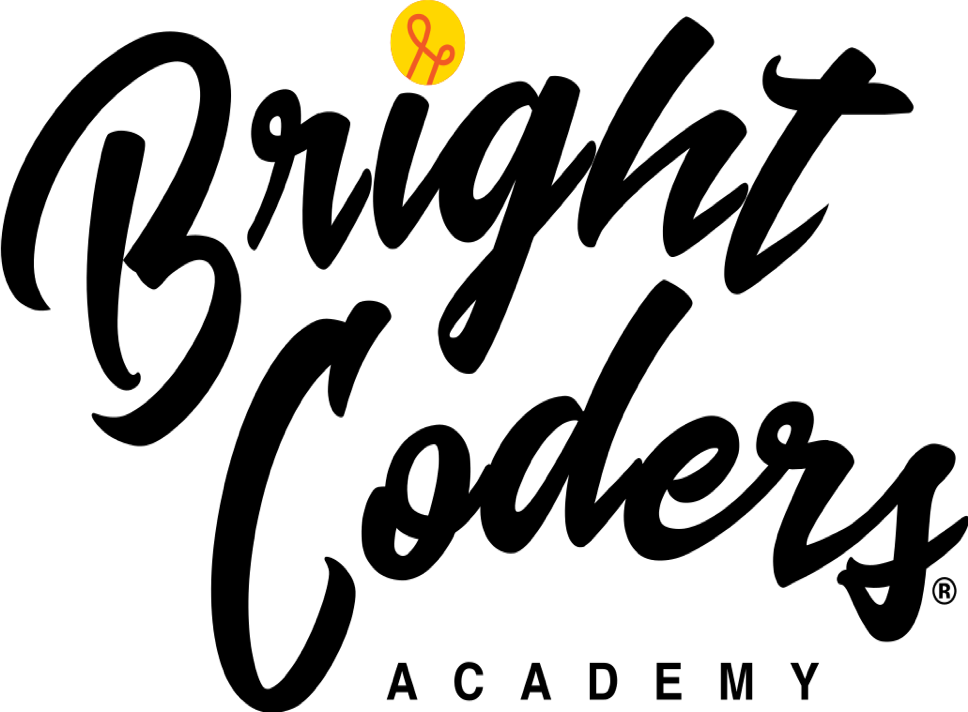

# Programación Orientada a Objetos

Mediante este ejercicio queremos conocer tus habilidades de programación, puedes utilizar el lenguaje que prefieras pero procura utilizar el enfoque de programación orientada a objetos.

No vamos a evaluar que tan experto eres, sino lo que buscamos es comprobar que tienes las bases necesarias.

## Instrucciones
- El reto consiste en programar el algoritmo para The Bowling Game (detalles en la sección de abajo)
- Puedes utilizar el lenguaje que sea de tu preferencia
- Aplica los principios de la programación orientada a objetos
- La solución debe ser de tu autoría, ya que si utilizas código tomado de otra persona en automático serías descalificado
- Dispones de una semana para trabajar en este reto.
- El código fuente deberás publicarlo en un repositorio de Github y reportar el enlace en esta plataforma antes de la fecha límite establecida. En tu repositorio deberán estar todos los recursos necesarios para ejecutar tu solución.
 

## The Bowling Game

- The game consists of 10 frames as shown above. In each frame the player has two opportunities to knock down 10 pins. The score for the frame is the total number of pins knocked down, plus bonuses for strikes and spares.
  
- A spare is when the player knocks down all 10 pins in two tries. The bonus for that frame is the number of pins knocked down by the next roll. So in frame 3 above, the score is 10 (the total number knocked down) plus a bonus of 5 (the number of pins knocked down on the next roll.)

- A strike is when the player knocks down all 10 pins on his first try. The bonus for that frame is the value of the next two balls rolled.

- In the tenth frame a player who rolls a spare or strike is allowed to roll the extra balls to complete the frame. However no more than three balls can be rolled in tenth frame.